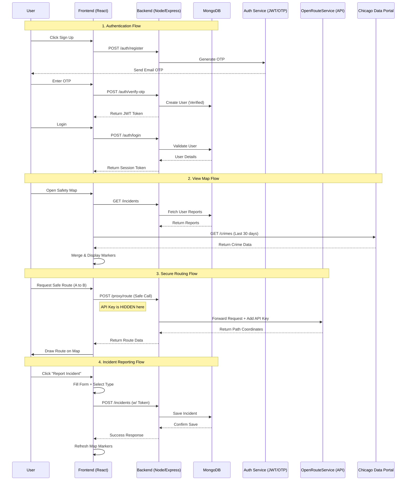

# Application Flow Diagram

You can copy and paste the code below into **[Mermaid Live Editor](https://mermaid.live/)** or **Draw.io** to generate a professional flow diagram for your project.

```mermaid
sequenceDiagram
    participant User
    participant Frontend as Frontend (React)
    participant Backend as Backend (Node/Express)
    participant Database as MongoDB
    participant Auth as Auth Service (JWT/OTP)
    participant ORS as OpenRouteService (API)
    participant Chicago as Chicago Data Portal

    %% Authentication Flow
    Note over User, Database: 1. Authentication Flow
    User->>Frontend: Click Sign Up
    Frontend->>Backend: POST /auth/register
    Backend->>Auth: Generate OTP
    Auth-->>User: Send Email OTP
    User->>Frontend: Enter OTP
    Frontend->>Backend: POST /auth/verify-otp
    Backend->>Database: Create User (Verified)
    Backend-->>Frontend: Return JWT Token
    
    %% Login
    User->>Frontend: Login
    Frontend->>Backend: POST /auth/login
    Backend->>Database: Validate User
    Database-->>Backend: User Details
    Backend-->>Frontend: Return Session Token

    %% Map Data Flow
    Note over User, Chicago: 2. View Map Flow
    User->>Frontend: Open Safety Map
    Frontend->>Backend: GET /incidents
    Backend->>Database: Fetch User Reports
    Database-->>Backend: Return Reports
    Frontend->>Chicago: GET /crimes (Last 30 days)
    Chicago-->>Frontend: Return Crime Data
    Frontend->>Frontend: Merge & Display Markers

    %% Routing Flow
    Note over User, ORS: 3. Secure Routing Flow
    User->>Frontend: Request Safe Route (A to B)
    Frontend->>Backend: POST /proxy/route (Safe Call)
    Note right of Frontend: API Key is HIDDEN here
    Backend->>ORS: Forward Request + Add API Key
    ORS-->>Backend: Return Path Coordinates
    Backend-->>Frontend: Return Route Data
    Frontend->>User: Draw Route on Map

    %% Reporting Flow
    Note over User, Database: 4. Incident Reporting Flow
    User->>Frontend: Click "Report Incident"
    Frontend->>Frontend: Fill Form + Select Type
    Frontend->>Backend: POST /incidents (w/ Token)
    Backend->>Database: Save Incident
    Database-->>Backend: Confirm Save
    Backend-->>Frontend: Success Response
    Frontend->>Frontend: Refresh Map Markers
```
